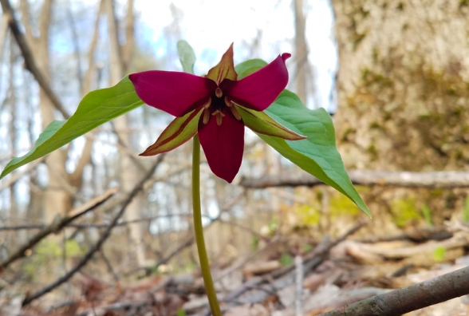
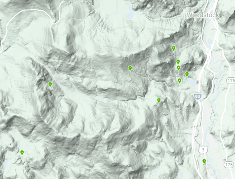

# Trillium

Trillium genus are long-lived, woodland, perennial wildflower found throughout eastern North America. In this example, I have temperature, precipitation and basic land cover data. I will use that to try to model Trillium distribution.

[*Trillium grandiflorum*](https://www.fs.fed.us/wildflowers/plant-of-the-week/trillium_grandiflorum.shtml) occurs on well-drained, rich, mesic soils in deciduous or mixed deciduous/coniferous forests. [*Trillium undulatum*](https://www.fs.fed.us/wildflowers/plant-of-the-week/trillium_undulatum.shtml) occurs in mesic, northern hardwoods, mixed conifer-hardwood forests, to pinewoods and high-elevation red spruce forests in very acidic humus-rich soils.

Red Trillium

Painted Trillium

[Hubbard Brook](https://www.caryinstitute.org/science/research-projects/hubbard-brook-ecosystem-study) is an experimental forest in New Hampshire. It is in a watershed surrounded by a ridge with Hubbard Brook flowing west to east. There are few *Trillium* observations in the GBIF database in the experimental forest though *Trillium* occurs there.

