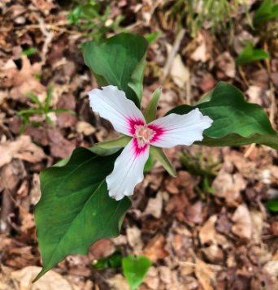

# Species-Dist-Modeling---Painted Trillium

A project to learn how to do species distribution modeling (SDM) in R. Ultimately, I'll use the biomod2 package but in the learning phase, I am running models without it.

To explore

* Trillium VTNH Background.Rmd -- not interesting
* Trillium VTNH Data.Rmd -- start here. Gets all the data set up to run an SDM.
* Trillium VTNH GLM.Rmd -- fits GLM and GAM SDMs. Fairly hairy file to figure out how the models are performing and figure out decent set of environmental variables.

Example of 4 SDMs for Painted Trillium using different variables.

