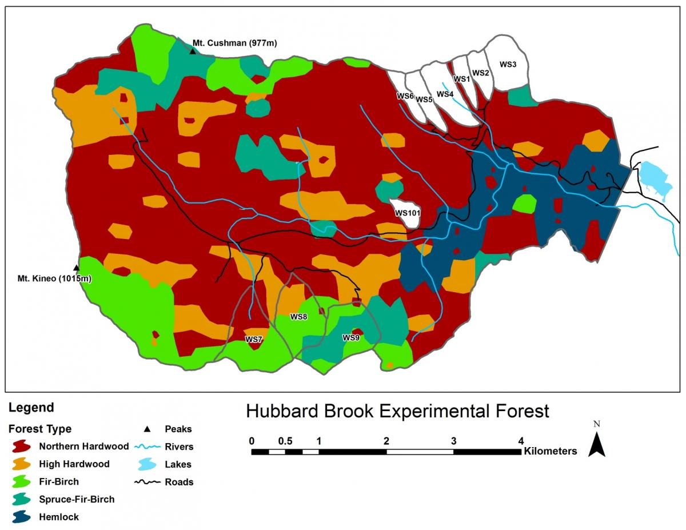

```{r setup, include=FALSE}
knitr::opts_chunk$set(echo = TRUE, warning=FALSE, message=FALSE, cache=FALSE)
```

# Set up

This example will use the following libraries.
```{r}
library(biomod2)
library(corrplot)
library(MASS)
library(ggplot2)
library(ecospat)
library(gam)
library(usdm)
```

## Load the data

The data were prepared in `Trillium-VTNH-Data.Rmd` and saved. The data object is called `dat`.
```{r}
load("data/trillium_with_predictors.RData")
allVars <- raster::brick("data/allVars.grd")
```
I want to use the presence data for *Trillium undulatum* and there are some NAs in slope and aspect so I'll get rid of those.
```{r}
datsub <- subset(dat, species=="Trillium undulatum")
datsub <- na.omit(datsub)
```
There are a few covariates that I know I don't want. Specifically, the wet and dry qtr variables because that is summer in some cells and winter in others. Also I'll exclude Snow, since that is all 0. And I'll exclude `cells` and `species` since I don't use those ever. Finally, dominant land cover is a categorical variable so I will exclude that (to make my life easier).
```{r}
datsub <- datsub[, !stringr::str_detect(colnames(datsub),"[.]wet[.]")]
datsub <- datsub[, !stringr::str_detect(colnames(datsub),"[.]dry[.]")]
datsub <- subset(datsub, select=c(-cells, -species, -Dominant.Land.Cover, -Snow))
```

# Variable correlation

First I will use the corrplot package to look at correlation. 
```{r}
tmpdat <-subset(datsub, select=stringr::str_detect(colnames(datsub), "precip"))
varCor <- cor(tmpdat, use = "na.or.complete")
corrplot::corrplot(varCor)
```

Many of the temperature variables are very correlated.
```{r}
tmpdat <-subset(datsub, select=stringr::str_detect(colnames(datsub), "temp"))
varCor <- cor(tmpdat, use = "na.or.complete")
corrplot::corrplot(varCor)
```

After exploring the models, I came up with the following set of not too correlated variables that still explain much of the variability in presence/absence. But below I will also try variance inflation to select a set of non-collinear variables.

```{r}
envvars <- c("mean.temp", "temp.diurnal.range", "temp.seasonality", "precip.warm.qtr", "precip.cold.qtr")
```

That gets me a set of variables that are not so horribly correlated.
```{r}
tmpdat <- datsub[,envvars]
varCor <- cor(tmpdat, use = "na.or.complete")
corrplot::corrplot(varCor)
```

And the variance inflation factors look ok.
```{r}
usdm::vif(tmpdat)
```

## Variables for models

I'll test models with all variables and then these subsets.

```{r}
topovars <- c("elevation", "slope", "aspect")
lcvars <- c("Tree.Cover", "mean.temp", "precip.warm.qtr" )
envvars <- c("mean.temp", "temp.diurnal.range", "temp.seasonality", "precip.warm.qtr", "precip.cold.qtr")
```

# Train/Test

We set up a training set of presence data and a test set. `kfold` is just a function to randomly assign the data to `k` groups. I want just the presence data so will subset to `pa` column equal 1. I will call the presence only data `presdat`.

```{r}
#set.seed(10)
presdat <- subset(datsub, pa==1)
group <- dismo::kfold(presdat, k=5) # 5 groups = 20 test/80 train split
```

The testing data will be `group==1` and training data will be the rest.
```{r}
pres_train <- presdat[group != 1, ]
pres_test <- presdat[group == 1, ]
```

Repeat for the background data.
```{r}
bgdat <- subset(datsub, pa==0)
group <- dismo::kfold(bgdat, k=5) 
backg_train <- bgdat[group != 1, ]
backg_test <- bgdat[group == 1, ]
```

We make separate presence and background train/test sets for evaluation purposes later. But for fitting we need a data frame with both train data sets (presence and background) together.
```{r}
traindat <- rbind(pres_train, backg_train)
```

I'll make a holder for the model output.
```{r}
modellist <- list()
```

# Fit GLM


## All variables

The full set of variables of highly correlated variables. As an experiment, I will use variable inflation to select a set of non-correlated variables.
```{r}
vifres <- usdm::vifstep(subset(traindat, select=c(-pa, -lon, -lat)))
vifvars <- as.character(vifres@results$Variables)
vifvars
```

Fit a generalized linear model with the VIF selected variables. Because I am using `pa~.` to select all variables, I need to make `traindat.sub` without the variables that should not be included.
```{r results="hide"}
traindat.sub <- traindat[,c("pa", vifvars)]
glmVIF <- stats::glm(formula =pa ~ ., 
                family = binomial(link = "logit"),
                data=traindat.sub)
```
Save.
```{r}
modellist[["glmVIF"]] <- list(model=glmVIF, name="glmVIF", desc="GLM - all VIF variables", terms=vifvars)
```


## Variable selection

That model has a lot of variables. Let's try stepwise variable selection using AIC as criteria. 
```{r results="hide"}
glmStep <- MASS::stepAIC(object=glmVIF, 
                     scope=pa ~ .,
                     data = traindat.sub,
                     direction = "both", 
                     trace = -1, # no output
                     k = 2, 
                     control=glm.control(maxit=500))
modellist[["glmStep"]] <- list(model=glmStep, name="glmStep", desc="GLM - variables selected w step AIC", terms=attr(glmStep$terms, "term.labels"))
```

Let's look at the best model.
```{r}
anova(glmStep)
```


## Variable importance

Let's look at the variable importance.
```{r}
varimp <- biomod2::variables_importance(glmVIF, data=traindat)$mat
varimp[varimp>0.01,]
```

## Environmental variables

Fit a generalized linear model with all the environmental variables.
```{r results="hide"}
glmEnv <- stats::glm(formula =pa ~ ., 
                family = binomial(link = "logit"),
                data=traindat[,c("pa",envvars)])
modellist[["glmEnv"]] <- list(model=glmEnv, name="glmEnv", desc="GLM - environmental variables", terms=envvars)
```

## Topography only

We will compare to a topography only model.
```{r results="hide"}
glmTopo <- stats::glm(formula =pa ~ ., 
                family = binomial(link = "logit"),
                data=traindat[,c("pa", topovars)])
modellist[["glmTopo"]] <- list(model=glmTopo, name="glmTopo", desc="GLM - topographical variables", terms=topovars)
```

## Tree Cover only

We will compare to a tree cover plus temperature and precipition model.
```{r results="hide"}
glmLC <- stats::glm(formula =pa ~ ., 
                family = binomial(link = "logit"),
                data=traindat[,c("pa", lcvars)])
modellist[["glmLC"]] <- list(model=glmLC, name="glmLC", desc="GLM - LC variables", terms=lcvars)
```

Here are the AICs so far.
```{r}
unlist(lapply(modellist, function(x){AIC(x$model)}))
```


## AUC curves

```{r}
par(mfrow=c(2,3), mar=c(5, 4, 3, 2) + 0.1)
nm <- length(modellist)
for(i in names(modellist)){
erf.1 <- dismo::evaluate(pres_test, backg_test, model=modellist[[i]]$model)
plot(erf.1, 'ROC')
title(paste0(i,"\n\n"))
}
```

## Boyce Index

Let's check model quality using the Boyce Index. First I will add the index to all my model lists.

```{r results="hide"}
for(i in names(modellist)){
  pm <- predict(allVars,
              modellist[[i]]$model,
              type="response")
bindex <- ecospat::ecospat.boyce(pm, cbind(pres_test$lon, pres_test$lat), PEplot=FALSE)
modellist[[i]]$bindex <- bindex
}
```
Then I'll make a data frame.
```{r}
dfb <- data.frame(x=NULL, y=NULL, model=NULL)
for(i in names(modellist)){
  bi <- modellist[[i]]$bindex
  a <- data.frame(y=bi$F.ratio, x=bi$HS, model=i)
  dfb <- rbind(dfb, a)
}
dfb$observed <- "yes"
dfb$observed[dfb$y==0] <- "no"
```
Now I can use that data frame with ggplot.
```{r}
p <- ggplot(dfb, aes(x=x, y=y)) + geom_point(aes(col=observed)) +
  ylab("Boyce Index") + xlab("Suitability")
p + facet_wrap(~model) +
  ggtitle("Evaluation of the test data performance")
```


Our model with environmental variables is ok (it goes up as x increases). Our pure topographical model doesn't look as good. Where there is high suitability there are no observations. 

## Predictions

To plot predictions on the NH+VT map, I need to pass in the raster stack of the predictor variables and the model. I want to use `type=response` in order to get the probabilities (which is what a binomial fit returns).
```{r}
pg.topo <- predict(allVars, glmTopo, type="response")
pg.env <- predict(allVars, glmEnv, type="response")
```
Now we can plot the prediction. Because I am making similar plots, I will make a function for my plots so they all look the same.
```{r}
pm.plot <- function(x, main="", scale.min=0, scale.max=1, ..., mar=c(5,4,4,5)){
  par(mar=mar)
  plot(x, main=main, breaks=seq(scale.min, scale.max, (scale.max-scale.min)/10), col = terrain.colors(11),
       xlab="Longitude", ylab="Latitude", cex=0.75, ...)
 plot(nhvtshp, add=TRUE, border="blue")
 plot(hbshp, add=TRUE)
}
```
Now make the prediction plots.
```{r}
par(mfrow=c(1,2))
pm.plot(pg.topo, main='Topographical Variables')
pm.plot(pg.topo, main='Environmental Variables')
```
Let's zoom in on Hubbard Brook.
```{r}
par(mfrow=c(1,2))
xlims <- c(-71.9,-71.6)
ylims <- c(43.875,44)
pm.plot(pg.topo, main='Topographical Variables', xlim=xlims, ylim=ylims, scale.max=0.5)
pm.plot(pg.env, main='Environmental Variables', xlim=xlims, ylim=ylims, scale.max=0.5)
```

# GAM Model

The GAM formula in R looks like `response ~ s(var1, sm) + s(var2, sm)`. The `s()` is the spline function and allows the response to be non-linear. The second number, `sm` is the amount of smoothing and the default way you specify this is different for the `gam::gam()` function versus the `mcgv::gam()` function. Here I use `gam::gam()` and use the `df` argument (default). `df=1` would be linear.

I will write a function to make my formula for the `gam()` call. That way I don't have to make it manually.
```{r}
gamfm <- function(x, df, f=NULL){
  if(length(f)!=0) x<-x[x!=f]
fm <- paste0('s(', x, ', ', df, ')', collapse = ' + ')
if(length(f)!=0){
  ff <- paste0(f, collapse = ' + ')
  fm <- paste(fm,ff, sep="+")
}
fm <- as.formula(paste('pa ~', fm))
return(fm)
}
```

## Topographical only model

```{r}
gamTopo2 <- gam::gam(formula = gamfm(topovars, 2),
            data=traindat, 
            family="binomial")
gamTopo4 <- gam::gam(formula = gamfm(topovars, 4),
            data=traindat, 
            family="binomial")
```
Save models.
```{r}
mod <- paste0("gamTopo", c(2,4))
desc <- paste0("GAM - Topo variables df=", c(2,4))
for(i in 1:2){
  pm <- predict(allVars, get(mod[i]), type="response")
bindex <- ecospat::ecospat.boyce(pm, cbind(pres_test$lon, pres_test$lat), PEplot=FALSE)
modellist[[mod[i]]] <- list(model=get(mod[i]), name=mod[i], desc=desc[i], terms=topovars, bindex = bindex)
}
```

## Land cover model

```{r}
gamLC2 <- gam::gam(formula = gamfm(lcvars,2),
            data=traindat, 
            family="binomial")
gamLC4 <- gam::gam(formula = gamfm(lcvars,4),
            data=traindat, 
            family="binomial")
```

Save models.
```{r}
mod <- paste0("gamLC", c(2,4))
desc <- paste0("GAM - Tree Cover variables df=", c(2,4))
for(i in 1:2){
  pm <- predict(allVars, get(mod[i]), type="response")
bindex <- ecospat::ecospat.boyce(pm, cbind(pres_test$lon, pres_test$lat), PEplot=FALSE)
modellist[[mod[i]]] <- list(model=get(mod[i]), name=mod[i], desc=desc[i], terms=topovars, bindex = bindex)
}
```

## Enviromental model


```{r}
gamEnv2 <- gam::gam(formula = gamfm(envvars, 2),
            data=traindat, 
            family="binomial")
gamEnv4 <- gam::gam(formula = gamfm(envvars, 4),
            data=traindat, 
            family="binomial")
```

Save models.
```{r}
mod <- paste0("gamEnv", c(2,4))
desc <- paste0("GAM - Environmental variables df=", c(2,4))
for(i in 1:2){
  pm <- predict(allVars, get(mod[i]), type="response")
bindex <- ecospat::ecospat.boyce(pm, cbind(pres_test$lon, pres_test$lat), PEplot=FALSE)
modellist[[mod[i]]] <- list(model=get(mod[i]), name=mod[i], desc=desc[i], terms=topovars, bindex = bindex)
}
```

## Minimal GAM Model

This one will use just 3 environmental variables.

```{r}
minEnvVars <- c("precip.warm.qtr", "mean.temp", "temp.diurnal.range")
gamEnvMin <- gam::gam(formula = gamfm(minEnvVars, 4),
            data=traindat, 
            family="binomial")
pm <- predict(allVars, gamEnvMin, type="response")
bindex <- ecospat::ecospat.boyce(pm, cbind(pres_test$lon, pres_test$lat), PEplot=FALSE)
modellist[["gamEnvMin"]] <- list(model=gamEnvMin, name="gamEnvMin", desc="GAM - Minimal", terms=minEnvVars, bindex = bindex)
```

## Effect size curves

Let's look at the GAM effect size curves for the model with 5 environmental variables.
```{r}
po <- gam:::preplot.Gam(gamEnv4, terms = attr(terms(gamEnv4), "term.labels"))
dfenv <- data.frame(x=NULL, y=NULL, se=NULL, variable=NULL)
for(i in names(po)){
  vname <- stringr::str_replace(i, "s[(]", "")
  vname <- stringr::str_replace(vname, ", 4[)]", "")
  a <- data.frame(x=po[[i]]$x, y=po[[i]]$y, se=po[[i]]$se.y, variable=vname)
  dfenv <- rbind(dfenv, a)
}
p <- ggplot(dfenv, aes(x=x, y=y)) + geom_line() +
  geom_ribbon(aes(ymin=y+2*se, ymax=y-2*se), col="grey", alpha=0.5) +
  ylab("effect size")
p + facet_wrap(~variable, scales="free")
```

## Predictions

Compare the topo, LC and environmenal predictions.

```{r}
pg.topo <- predict(allVars, gamTopo4, type="response")
pg.env <- predict(allVars, gamEnv4, type="response")
pg.lc <- predict(allVars, gamLC4, type="response")
pg.min <- predict(allVars, gamEnvMin, type="response")
```

Now make the prediction plots.
```{r}
par(mfrow=c(2,2))
mar <- c(0,0,2,0)
pm.plot(pg.topo, main='Topographical Variables', legend=FALSE, axes=FALSE, box=FALSE, mar=mar)
pm.plot(pg.env, main='Environmental Variables', legend=FALSE, axes=FALSE, box=FALSE, mar=mar)
pm.plot(pg.lc, main='Tree Cover Variables', legend=FALSE, axes=FALSE, box=FALSE, mar=mar)
pm.plot(pg.min, main='Three Env Variables', legend=FALSE, axes=FALSE, box=FALSE, mar=mar)
```

The environmental plot with the points.
```{r}
par(mfrow=c(1,2))
pm.plot(pg.env, main='Environmental Variables')
pm.plot(pg.env, main='with observations')
psub <- subset(dat, species=="Trillium undulatum" & pa==1)
sp::coordinates(psub) <- c("lon", "lat")
plot(psub, pch=".", cex=1, col="red", add=TRUE)
```


# Model comparisons


## AUCs

```{r}
aucs <- unlist(lapply(modellist,function(x){
  dismo::evaluate(pres_test, backg_test, model=x$model)@auc
}))
sort(aucs)
```

## Boyce Index - Spearman

Let's look at the Spearman correlations from the Boyce Index. 
```{r}
bis <- unlist(lapply(modellist,function(x){
  x$bindex$Spearman.cor
}))
sort(bis)
```

LC4 is highest though that one has no observations where the suitability is highest.
```{r}
dfb <- data.frame(x=NULL, y=NULL, model=NULL)
for(i in c("gamEnv4","gamLC4","gamEnvMin")){
  bi <- modellist[[i]]$bindex
  a <- data.frame(y=bi$F.ratio, x=bi$HS, model=i)
  dfb <- rbind(dfb, a)
}
dfb$observed <- "yes"
dfb$observed[dfb$y==0] <- "no"
p <- ggplot(dfb, aes(x=x, y=y)) + geom_point(aes(col=observed)) +
  ylab("Boyce Index") + xlab("Suitability")
p + facet_wrap(~model, scales = "free_y") +
  ggtitle("Evaluation of the test data performance")
```

## Hubbard Brook comparisons

Let's zoom in on Hubbard Brook. The observations to the far right are next to the labs. The GLM makes the ridges (boundary) much higher in suitability than the lower elevation brook bottom (center). The model with tree cover also makes the ridge more suitable than the lower elevation.
```{r}
par(mfrow=c(2,2))
xlims <- c(-71.9,-71.6)
ylims <- c(43.875,44)
mar <- c(0,0,3,0)
for(i in c("gamEnvMin", "gamEnv4", "gamLC4", "gamTopo4")){
pg <- predict(allVars, get(i), type="response")
pm.plot(pg, main=i, xlim=xlims, ylim=ylims, scale.max=0.5, box=FALSE, axes=FALSE, legend=FALSE, mar=mar)
plot(psub, pch=4, cex=1, col="red", add=TRUE)
}
```

Tree composition in Hubbard Brook also tracks these environmental conditions it looks like.
{width="400px"}

<!--
```{r}
pgm <- raster::mask(pg, raster::buffer(hbshp, width=0.001))
plot(pgm, main='Playing with masking', xlim=xlims, ylim=ylims)
plot(hbshp, add=TRUE)
```
-->


## Response curves

```{r}
rp <- biomod2::response.plot2(models = c('glmTopo', 'gamTopo4'),
                     Data = traindat,
                     show.variables = topovars,
                     fixed.var.metric = 'mean', plot = FALSE, use.formal.names = TRUE)
```
For plotting, we'll use ggplot2 and make a custom theme.
```{r}
## define a custom ggplot2 theme
rp.gg.theme <- theme(legend.title = element_blank(),
                     axis.text.x = element_text(angle = 90, vjust = .5),
                     panel.background = element_rect(fill = NA, colour = "gray70"),
                     strip.background = element_rect(fill = NA, colour = "gray70"),
                     panel.grid.major = element_line(colour = "grey90"),
                     legend.key = element_rect(fill = NA, colour = "gray70"))
```
Now we can plot.
```{r}
gg.rp <- ggplot(rp, aes(x = expl.val, y = pred.val, lty = pred.name)) +
  geom_line() + ylab("prob of occ") + xlab("") + 
  rp.gg.theme + 
  facet_grid(~ expl.name, scales = 'free_x') + 
  ggtitle("Topographical variables")
print(gg.rp)
```

Repeat the same for the environmental variables model. Not all these model have all the envvars terms.
```{r}
rp <- biomod2::response.plot2(models = c('glmVIF', 'glmEnv', 'gamEnv4', 'gamLC4'),
                     Data = traindat,
                     show.variables = envvars,
                     fixed.var.metric = 'mean', plot = FALSE, use.formal.names = TRUE)
```

```{r}
gg.rp <- ggplot(rp, aes(x = expl.val, y = pred.val, col = pred.name)) +
  geom_line() + ylab("prob of occ") + xlab("") + 
  rp.gg.theme + 
  facet_wrap(~ expl.name, scales = 'free_x') +
  ggtitle("Environmental variables")
print(gg.rp)
```

## Boyce Indices 

Boyce plots for all variables.
```{r}
dfb <- data.frame(x=NULL, y=NULL, model=NULL)
for(i in names(modellist)){
  bi <- modellist[[i]]$bindex
  a <- data.frame(y=bi$F.ratio, x=bi$HS, model=i)
  dfb <- rbind(dfb, a)
}
dfb$observed <- "yes"
dfb$observed[dfb$y==0] <- "no"

p <- ggplot(dfb, aes(x=x, y=y)) + geom_point(aes(col=observed)) +
  ylab("Boyce Index") + xlab("Suitability")
p + facet_wrap(~model, scales = "free_y") +
  ggtitle("Evaluation of the test data performance")
```


# Model comparison table (seed=10)

Compare AICs, Spearman Correlation for the models with seed = 10.
```{r}
df <- data.frame(
  name=unlist(lapply(modellist, function(x){x$name})),
  Spearman=unlist(lapply(modellist, function(x){x$bindex$Spearman.cor})),
  AUC=unlist(lapply(modellist,function(x){dismo::evaluate(pres_test, backg_test, model=x$model)@auc})),
  AIC=unlist(lapply(modellist, function(x){AIC(x$model)}))
)
df$delAIC <- df$AIC-min(df$AIC)
df <- df[order(df$AIC),]
knitr::kable(df, row.names=FALSE)
```

## Comparison across other training data

I want to make sure that the selected variables are not changing a lot with different random test splits.  I'll make 20 random splits and look for variables that seem problematic (effect changes depending on the random data). I am going to select 50% of my data for training instead of 80%. I want to see how the variable selection and importance changes with different training data.

```{r}
datlist <- list()
n=10
k=2
presdat <- subset(datsub, pa==1)
bgdat <- subset(datsub, pa==0)
for(i in 1:n){
group <- dismo::kfold(presdat, k=k) # 5 groups = 20 test/80 train split
pres_train <- presdat[group != 1, ]
pres_test <- presdat[group == 1, ]
group <- dismo::kfold(bgdat, k=k) # 3 groups = 25 test/75 train split
backg_train <- bgdat[group != 1, ]
backg_test <- bgdat[group == 1, ]
traindat <- rbind(pres_train, backg_train)
datlist[[i]] <- list(pres_train=pres_train, pres_test=pres_test, 
                     backg_train=backg_train, backg_test=backg_test,
                     traindat=traindat)
}
```

```{r}
modlist <- list()
for(i in 1:n){
gamEnv <- gam::gam(formula = gamfm(envvars, 4),
            data=datlist[[i]]$traindat, 
            family="binomial")
modlist[[paste("split",i)]] <- gamEnv
}
```

```{r}
df <- data.frame()
for(i in 1:n){
  mod1 <- modlist[[i]]
rp <- biomod2::response.plot2(models = "mod1",
                     Data = datlist[[i]]$traindat,
                     show.variables = envvars,
                     fixed.var.metric = 'mean', plot = FALSE, use.formal.names = TRUE)
df <- rbind(df, cbind(rp, i=paste("samp", i)))
}
```

```{r}
gg.rp <- ggplot(df, aes(x = expl.val, y = pred.val)) +
  geom_line(aes(col=i)) + ylab("prob of occ") + xlab("") + 
  rp.gg.theme + 
  facet_wrap(~ expl.name, scales = 'free_x') +
  ggtitle("Response curves across random samples") +
  theme(legend.position = "none")
print(gg.rp)
```

```{r}
df2 <- data.frame()
for(i in 1:n){
  gamStart <- gam::gam(formula = gamfm(envvars, 4),
            data=datlist[[i]]$traindat, 
            family="binomial")
  varimp <- biomod2::variables_importance(gamStart, data=datlist[[i]]$traindat)$mat
  varimp <- varimp[varimp[,1]!=0,]
  df2 <- rbind(df2, data.frame(varimp=varimp, term=names(varimp), i=paste("samp", i)))
}
```

```{r}
gg.rp <- ggplot(df2, aes(term, varimp)) +
  geom_boxplot() + coord_flip() +
  ggtitle("Variable importance across data sets")
print(gg.rp)
```


# Models across many seeds

Now rerun the analysis with many different random splits of the data and see how variable the results are.

```{r eval=FALSE}
n <- 20
allmodels <- list()
for(mn in 1:n){
  cat(mn," ") #progress
presdat <- subset(datsub, pa==1)
group <- dismo::kfold(presdat, k=5) # 5 groups = 20 test/80 train split
pres_train <- presdat[group != 1, ]
pres_test <- presdat[group == 1, ]
bgdat <- subset(datsub, pa==0)
group <- dismo::kfold(bgdat, k=5) 
backg_train <- bgdat[group != 1, ]
backg_test <- bgdat[group == 1, ]
traindat <- rbind(pres_train, backg_train)

modellist <- list()

glmVIF <- stats::glm(formula =pa ~ ., 
                family = binomial(link = "logit"),
                data=traindat[,c("pa", vifvars)])
modellist[["glmVIF"]] <- list(model=glmVIF, name="glmVIF", desc="GLM - all VIF variables", terms=vifvars)

glmStep <- MASS::stepAIC(object=glmVIF, 
                     scope=pa ~ .,
                     data = traindat.sub,
                     direction = "both", 
                     trace = -1, #quiet
                     k = 2, 
                     control=glm.control(maxit=500))
modellist[["glmStep"]] <- list(model=glmStep, name="glmStep", desc="GLM - variables selected w step AIC", terms=attr(glmStep$terms, "term.labels"))

glmLC <- stats::glm(formula =pa ~ ., 
                family = binomial(link = "logit"),
                data=traindat[,c("pa",lcvars)])
modellist[["glmLC"]] <- list(model=glmLC, name="glmLC", desc="GLM - LC variables", terms=lcvars)

glmTopo <- stats::glm(formula =pa ~ ., 
                family = binomial(link = "logit"),
                data=traindat[,c("pa",topovars)])
modellist[["glmTopo"]] <- list(model=glmTopo, name="glmTopo", desc="GLM - topo variables", terms=topovars)

glmEnv <- stats::glm(formula =pa ~ ., 
                family = binomial(link = "logit"),
                data=traindat[,c("pa",envvars)])
modellist[["glmEnv"]] <- list(model=glmEnv, name="glmEnv", desc="GLM - environmental variables", terms=envvars)

gamEnvMin <- gam::gam(formula = gamfm(minEnvVars, 4),
            data=traindat, 
            family="binomial")
modellist[["gamEnvMin"]] <- list(model=gamEnvMin, name="gamEnvMin", desc="GAM - Minimal", terms=minEnvVars)

gamTopo2 <- gam::gam(formula = gamfm(topovars, 2),
            data=traindat, 
            family="binomial")
gamTopo4 <- gam::gam(formula = gamfm(topovars, 4),
            data=traindat, 
            family="binomial")
mod <- paste0("gamTopo", c(2,4))
desc <- paste0("GAM - Topo variables df=", c(2,4))
for(i in 1:2){
modellist[[mod[i]]] <- list(model=get(mod[i]), name=mod[i], desc=desc[i], terms=topovars)
}

gamLC2 <- gam::gam(formula = gamfm(lcvars,2),
            data=traindat, 
            family="binomial")
gamLC4 <- gam::gam(formula = gamfm(lcvars,4),
            data=traindat, 
            family="binomial")

mod <- paste0("gamLC", c(2,4))
desc <- paste0("GAM - Tree Cover variables df=", c(2,4))
for(i in 1:2){
modellist[[mod[i]]] <- list(model=get(mod[i]), name=mod[i], desc=desc[i], terms=topovars)
}

gamEnv2 <- gam::gam(formula = gamfm(envvars, 2),
            data=traindat, 
            family="binomial")
gamEnv4 <- gam::gam(formula = gamfm(envvars, 4),
            data=traindat, 
            family="binomial")
mod <- paste0("gamEnv", c(2,4))
desc <- paste0("GAM - Environmental variables df=", c(2,4))
for(i in 1:2){
modellist[[mod[i]]] <- list(model=get(mod[i]), name=mod[i], desc=desc[i], terms=topovars)
}
for(i in names(modellist)){
  pm <- predict(allVars,
              modellist[[i]]$model,
              type="response")
bindex <- ecospat::ecospat.boyce(pm, cbind(pres_test$lon, pres_test$lat), PEplot=FALSE)
modellist[[i]]$bindex <- bindex
modellist[[i]]$AIC <- AIC(modellist[[i]]$model)
modellist[[i]]$AUC <- dismo::evaluate(pres_test, backg_test, model=modellist[[i]]$model)@auc
modellist[[i]]$Spearman.cor <- modellist[[i]]$bindex$Spearman.cor
}
allmodels[[mn]] <- modellist
}
save(allmodels, file="allmodels.RData")
df2 <- data.frame()
for(i in 1:length(allmodels)){
  minAIC <- min(unlist(lapply(allmodels[[i]], function(x){x$AIC})))
  for(j in names(allmodels[[i]])){
    mod <- allmodels[[i]][[j]]
  df2 <- rbind(df2, data.frame(n=i,model=j,delAIC=mod$AIC-minAIC, Spearman.cor=mod$Spearman.cor, AUC=mod$AUC, AIC=mod$AIC))
  }
}
df2$n <- as.factor(df$n)
df.allmodels <- df2
save(df.allmodels, allmodels, file="allmodels.RData")
save(df.allmodels, file="dfallmodels.RData")
```

```{r}
library(tidyr)
load("dfallmodels.RData")
df.long <- pivot_longer(df.allmodels, c(-n, -model), names_to = "term", values_to = "value")
p <- ggplot(df.long, aes(model, value))
p + geom_boxplot() + coord_flip() + facet_wrap(~term, scale="free_x")
```

