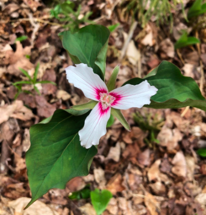

--- 
title: "SDMs - Trillium Example"
author: "E. E. Holmes"
date: "`r Sys.Date()`"
site: bookdown::bookdown_site
fontsize: 12pt
documentclass: book
bibliography: [book.bib, packages.bib]
biblio-style: apalike
link-citations: yes
description: "Example scripts for building SDMs for a terrestrial plant species."
cover-image: images/logo.png
favicon: "favicon.ico"
---


```{r RUNFIRST, echo=FALSE}
knitr::opts_chunk$set(echo = TRUE, comment=NA, tidy.opts=list(width.cutoff=60), tidy=TRUE, fig.align='center', out.width='80%')
```

# Overview {-}

A project to learn how to do species distribution modeling (SDM) in R. Ultimately, I'll use the biomod2 package but in the learning phase, I am running models without it.

<p align="center">
  
</p>


## Set-up - R and RStudio

If you have not updated R recently (in the last 6 months), go ahead and do that. Also update RStudio is you haven't done that recently.

* Download R [here](https://cran.r-project.org/)
* Download RStudio [here](https://rstudio.com/products/rstudio/download/)

## Get the shapefiles for Hubbard Brook

Create a project in RStudio for the SDM building. Within that project, create a folder called `data` and one called `code`. Within `data` create a folder called `hbef_boundary`. Go to the [Species-Dist-Modeling---Trillium](https://github.com/eeholmes/Species-Dist-Modeling---Trillium/tree/master/data/hbef_boundary) repository `hbef_boundary` folder and download all the files there into your `hbef_boundary` folder.

## Set-up - R packages

The code will use the following R packages which you will need to install. Open RStudio and go to the Packages tab on the right. Then click Install and search for the package.

```{r message=FALSE, warning=FALSE}
library(biomod2)
library(dismo)
library(sp)
library(raster)
library(ggplot2)
library(maps)
library(usdm)
library(ecospat)
library(corrplot)
library(MASS)
library(gam)
library(stringr) # for easy string manipulation
library(tidyr) # for data wrangling for ggplot
library(knitr) # for R Markdown
library(here) # for intelligent file directory navigation
```

## Data downloads

When you go through the Rmd files, it will download a lot of data into your project, but the next time you run the files, the code will look for the downloaded files and not rerun the downloads.

```{r include=FALSE}
# automatically create a bib database for R packages
knitr::write_bib(c(
  .packages(), 'bookdown', 'knitr', 'rmarkdown'
), 'packages.bib')
```

<!--chapter:end:index.Rmd-->

# Trillium

Trillium genus are long-lived, woodland, perennial wildflower found throughout eastern North America. In this example, I have temperature, precipitation and basic land cover data. I will use that to try to model Trillium distribution.

[*Trillium grandiflorum*](https://www.fs.fed.us/wildflowers/plant-of-the-week/trillium_grandiflorum.shtml) occurs on well-drained, rich, mesic soils in deciduous or mixed deciduous/coniferous forests. [*Trillium undulatum*](https://www.fs.fed.us/wildflowers/plant-of-the-week/trillium_undulatum.shtml) occurs in mesic, northern hardwoods, mixed conifer-hardwood forests, to pinewoods and high-elevation red spruce forests in very acidic humus-rich soils.

Red Trillium


Painted Trillium


[Hubbard Brook](https://www.caryinstitute.org/science/research-projects/hubbard-brook-ecosystem-study) is an experimental forest in New Hampshire. It is in a watershed surrounded by a ridge with Hubbard Brook flowing west to east. There are few *Trillium* observations in the GBIF database in the experimental forest though *Trillium* occurs there.


<!--chapter:end:01_Background.Rmd-->

# Shape files

The first step is to define the spatial extent of the area you will be working with and set up any shape files you need to plot boundaries or polygons or mask out areas.

```{r}
library(sp)
library(raster)
library(maps)
```

## Create the boundary box

First I need to define an `raster::extent` object for a box bounding NH and VT. This will be used to crop the data that we download. I can get a bounding box dynamically using `drawExtent()`. Click twice (upper corner/lower corner) on the map to select the region of interest. Don't go too far outside the lines.
```{r eval=FALSE}
maps::map('state', region=c('new hampshire', 'vermont', 'new york', 'massachusetts'))
NHVT <- raster::drawExtent()
```
or I can use longitude/latitude values for the box and use `extent()`:
```{r}
NHVT <- raster::extent(-73.61056, -70.60205, 42.48873, 45.37969)
```

## Get the states shapefile

I download the shapefile for the NH and VT state borders using `getData()` which gives polygons for countries. Level 1 will be the state boundaries (I assume). The shape file has all the states. Then I use `subset()` to get the two states that I want. `path` says where to save the downloaded file.
```{r}
usashp <- raster::getData('GADM', country='USA', level=1, path="data")
nhvtshp <- subset(usashp, NAME_1 %in% c("New Hampshire", "Vermont"))
nhshp <- subset(usashp, NAME_1 %in% c("New Hampshire"))
vtshp <- subset(usashp, NAME_1 %in% c("Vermont"))
```
Check the projection for this shapefile:
```{r}
crs(nhvtshp)
```

I can plot the shapes.
```{r}
plot(nhvtshp, border="blue", axes=TRUE)
```


## Get the Hubbard Brook boundary

I downloaded this shapefile separately and read it in. This will get the boundary of the Hubbard Brook Experimental Forest from a shapefile. Although I write "shapefile" singular, it is actually two files, the shapefile and some metafiles. If you look in the `hbef_boundary` folder you'll the metafiles.
```{r}
hbshp <- raster::shapefile("data/hbef_boundary/hbef_boundary.shp")
```
I check its projection and note that it is different from the NH+VT shapefile.
```{r}
crs(hbshp)
```
I transform the shapefile to get it on the same projection.
```{r}
newcrs <- crs(nhvtshp)
hbshp <- sp::spTransform(hbshp, newcrs)
```
Plot it.
```{r}
plot(hbshp)
```

## Plot the boundaries together

```{r}
plot(nhvtshp, border="blue", axes=TRUE)
plot(hbshp, add=TRUE)
text(-71.8, 44, "HBEF", pos=4)
```

## Save

I save the shapefile data to a file so I can use it later without rerunning this code.
```{r}
save(nhvtshp, hbshp, nhshp, vtshp, NHVT, file="data/shapefiles.RData")
```


<!--chapter:end:02_Shapefiles.Rmd-->

# Observation data

## Set-up

This example will use the following libraries:

```{r}
library(dismo)
library(sp)
library(here)
```

Load the shapefiles created earlier.
```{r}
load("data/shapefiles.RData")
```

## Download data

I will download occurrence data for *Trillium grandiflorum* and *Trillium undulatum* in my NHVT bounding box from the [Global Biodiversity Information Facility](https://www.gbif.org/). `nrecs` seems to be ignored. `geo` means only points with longitude and latitude. `removeZeros` means get rid of NA in location. `ext` is the bounding box to use. 

First I set where I will save the file and check if it is already there. I do this because if I rerun this script, I don't want to re-download. Note that GBIF data is updated weekly so using a time-stamp on your file might be good, but I am not doing that for this example.
```{r}
filePath <- file.path(here::here(), "data/trillium_presences.RData")
```
Now I download if I haven't downloaded already. The downloaded data has many columns that I don't need. I will subset the following columns. `select` in the `subset()` call says what columns to use. 
```{r}
if (!file.exists(filePath)) {
  # Download
  grandiflorum <- dismo::gbif("Trillium",
    species = "grandiflorum",
    nrecs = 300, geo = TRUE,
    removeZeros = TRUE, ext = NHVT
  )
  undulatum <- dismo::gbif("Trillium",
    species = "undulatum",
    nrecs = 300, geo = TRUE,
    removeZeros = TRUE, ext = NHVT
  )
  trillium.raw <- rbind(grandiflorum, undulatum)

  # select columns
  colsWeNeed <- c("species", "lat", "lon", "locality", "year", "coordinateUncertaintyInMeters", "occurrenceID", "occurrenceRemarks", "geodeticDatum")

  trillium.raw <- subset(trillium.raw, select = colsWeNeed)

  save(trillium.raw, file = "data/trillium_presences.RData")
}
```

Load in the presences data (saved from code above).
```{r}
load("data/trillium_presences.RData")
```

## Check the coordinate projection

Check the projection to make sure it makes sense and there is only one value. Check that it is the same projection as my other layers.
```{r}
unique(trillium.raw$geodeticDatum) # "WGS84"
```

## Make a sp object

`trillium.raw` is just a data frame. I make it a `sp` object (specifically a `SpatialPointsDataFrame`) using `sp::coordinates()` to specify which columns are the longitude and latitude.
```{r}
trillium <- trillium.raw
sp::coordinates(trillium) <- c("lon", "lat")
```
Check that it looks ok and there are no NAs.
```{r}
summary(trillium$lon)
summary(trillium$lat)
```


## Check for inaccurate location data

The `coordinateUncertaintyInMeters` column give the uncertainty of the observation location. Some of the uncertainties are huge and I don't want those.

```{r}
table(cut(trillium$coordinateUncertaintyInMeters, c(0, 200, 500, 1000, 2000, 5000)))
```
I am going to keep only those locations with a location accuracy within 200m.
```{r}
good <- which(trillium$coordinateUncertaintyInMeters < 200)
trillium <- trillium[good, ]
```

## Plot 

Now I can plot the occurrences points and add the NH and VT state boundaries. *Trillium undulatum* is much more common. Hubbard Brook is outlined in blue.
```{r}
plot(nhvtshp, border = "blue", axes = TRUE)
plot(subset(trillium, species == "Trillium grandiflorum"), pch = 3, cex = 1, add = TRUE)
plot(subset(trillium, species == "Trillium undulatum"), pch = 4, cex = 1, col = "red", add = TRUE)
plot(hbshp, add = TRUE, border = "blue")
```

## Save

I will save to the trillium file also. Later I will be subsetting and using a grid with `pa=1` if trillium was observed in that grid cell so I want to name it to be clear that this is the original observance data.
```{r}
trillium_observed <- trillium
save(trillium, trillium.raw, file = "data/trillium_presences.RData")
```

<!--chapter:end:03_Observations.Rmd-->

# Variables

I will download climate, landcover and elevation data to use as predictors.

## Set-up

This chapter will use the following libraries. These must be loaded for the code in this chapter to work. I've used `::` to clarify what functions are associated with what packages, but still the packages must be loaded to do any plotting.

```{r}
library(sp)
library(raster)
library(stringr)
```

I need to load in the shapefile data from Chapter 1.
```{r}
load("data/shapefiles.RData")
```

I have found that when working with large raster layers that RStudio can sometimes get very slow. In that case a call to the "garbage collection" `gc()` function to clear out temporary memory can help. If it doesn't then going to the Tools tab and restarting R will help. The latter will get rid of any variables in your working directory so make sure anything you need is saved.

## Climatic data

I will use the `getData` function from the `raster` package to get climate data. I will retrieve global bioclimatic variables at 0.5' (1km) resolution from [WorldClim](http://www.worldclim.org). This returns [19 bioclimatic variables](https://www.worldclim.org/data/bioclim.html). For the 0.5' resolution, I need to give it a center longitude and latitude and then it returns data centered on that in a 30 degrees longitude and latitude box. This is 300+ Mb but it will check if the directory exists and won't keep re downloading if you re-run the code. `path` tells it where to save the downloaded directory (which will be called `wc0.5`).
```{r}
bioclimVars <- raster::getData(
  name = "worldclim",
  res = 0.5,
  var = "bio",
  lon = mean(NHVT[1:2]),
  lat = mean(NHVT[3:4]),
  path = "data"
)
```

`bioclimVars` is a raster stack.
```
class(bioclimVars)
```
A raster stack is collection of many raster layers with the same projection, spatial extent and resolution. I don't know why `_13` is appended to the bioclim names by `getData()`.
```{r}
raster::extent(bioclimVars) # lons are x and lats are y
names(bioclimVars) # look at the variable names
```

### Crop and subset

I will crop down this raster stack to the NH+VT bounding box. 
```{r}
NHVTVars <- raster::crop(bioclimVars, NHVT)
```

Here I will plot just 3 of these variables.

* BIO10 = Mean Temperature of Warmest Quarter
* BIO15 = Precipitation Seasonality (how much precipitation varies during year)
* BIO19 = Precipitation of Coldest Quarter

```{r}
sub.NHVTVars <- subset(NHVTVars, c("bio10_13", "bio15_13", "bio19_13"))
```
Plot these three variables. This takes awhile. Note `bio10_13` is mean temperature times 10. That's how GBIF records temperature.
```{r}
plot(sub.NHVTVars)
```

Another why to make this stack is to read in the data from the downloaded files in `dir("wc0.5")`. Downloaded in `.bil` format and comprised of two files.
```{r}
fils <- dir("data/wc0.5", full.names = TRUE)
fils <- fils[stringr::str_detect(fils, "bil")]
```
Plot one layer.
```{r}
onelayer <- raster::raster(fils[1])
plot(onelayer, xlim = NHVT[1:2], ylim = NHVT[3:4])
# Add the NH VT lines on top
plot(nhvtshp, add = TRUE, border = "blue")
plot(hbshp, add = TRUE)
title(names(onelayer))
```
You can create a stack from the file names and then crop to the NH+VT bounding box.
```{r eval=FALSE}
# But for some reason when it reads in the bil file, it is not setting the projection from
# the header file. So I'll use the
NHVTVars <- raster::stack(fils)
NHVTVars <- raster::crop(NHVTVars, NHVT)
```

### Bioclim names

I want to make a data frame to use to get the descriptions for the variables. I made this by looking at the WorldClim website. `name` is the name of the variable in the downloaded data, `desc` is a description, `col` is what I will call the column.
```{r}
bioclimnames <- data.frame(
  name = paste0("bio", 1:19, "_13"),
  desc = c("Mean annual temperature", "Mean diurnal range (mean of max temp - min temp)", "Isothermality (bio2/bio7) (* 100)", "Temperature seasonality (standard deviation *100)", "Max temperature of warmest month", "Min temperature of coldest month", "Temperature annual range (bio5-bio6)", "Mean temperature of the wettest quarter", "Mean temperature of driest quarter", "Mean temperature of warmest quarter", "Mean temperature of coldest quarter", "Total (annual) precipitation", "Precipitation of wettest month", "Precipitation of driest month", "Precipitation seasonality (coefficient of variation)", "Precipitation of wettest quarter", "Precipitation of driest quarter", "Precipitation of warmest quarter", "Precipitation of coldest quarter"),
  col = c("mean.temp", "temp.diurnal.range", "isotherm", "temp.seasonality", "max.warm.temp", "min.cold.temp", "temp.annual.range", "mean.temp.wet.qtr", "mean.temp.dry.qtr", "mean.temp.warm.qtr", "mean.temp.cold.qtr", "total.precip", "precip.wet.month", "precip.dry.month", "precip.seasonality", "precip.wet.qtr", "precip.dry.qtr", "precip.warm.qtr", "precip.cold.qtr"),
  stringsAsFactors = FALSE
)
```

Do some memory clean-up before moving on.
```{r}
gc()
```

## Topographical data

I can read in elevation data with `getData()`. For USA, this returns a list of 4 raster layers. List 1 is mainland. Then I crop to my NHVT bounding box. I don't need to re-download the data if I already have it. `path` is the folder where the downloaded data will be stored. `mask=FALSE` means don't cut off the elevation data at the US-Canada border. The `USAelevation` object is about 80MB. That is not needed so you might not want to save that file.
```{r}
dirPath <- "data/elevation"
if (!dir.exists(dirPath)) dir.create(dirPath)
if (!file.exists("data/NHVTelevation.grd")) {
  USAelevation <- raster::getData("alt",
    country = "USA",
    path = "data/elevation",
    mask = FALSE
  )
  raster::writeRaster(USAelevation[[1]], filename = "data/USAelevation.grd", overwrite = TRUE)
  NHVT.elevation <- raster::crop(USAelevation[[1]], NHVT)
  raster::writeRaster(NHVT.elevation, filename = "data/NHVTelevation.grd", overwrite = TRUE)
} else {
  NHVT.elevation <- raster::raster("data/NHVTelevation.grd")
}
```
The plot of raw elevation is not so pretty. Later we will use the `hillshade()` function to make a nicer plot of elevation.
```{r}
plot(NHVT.elevation, axes = TRUE, legend.args = list(text = "elevation (m)", adj = 0.2))
```

### Slope and aspect

The `terrain()` function will return the slope and aspect from an elevation layer.
```{r}
NHVT.slope <- raster::terrain(NHVT.elevation, opt = "slope")
NHVT.aspect <- raster::terrain(NHVT.elevation, opt = "aspect")
```
Plot of aspect.
```{r}
plot(NHVT.aspect)
plot(nhvtshp, add = TRUE)
```

There is also a `hillShade()` function that makes a prettier elevation plot than the elevation data alone.
```{r}
hill <- raster::hillShade(NHVT.slope, NHVT.aspect, 40, 270)
plot(hill, col = grey(0:100 / 100), legend = FALSE, main = "NH and VT elevation")
plot(NHVT.elevation, col = rainbow(25, alpha = 0.35), add = TRUE)
plot(nhvtshp, add = TRUE)
plot(hbshp, add = TRUE)
```


## Land cover data

These data are downloaded from [EarthEnv land cover data set](https://www.earthenv.org/landcover) with a function called `getlandcover.R` in the code folder.

```{r}
fils <- paste0("data/landcover/lc_1km_", c(1:12, "dom"), ".tif")
# check if the files already exist, and if not, download
if (!all(file.exists(fils))) {
  getlandcover(gisdir = "data/landcover", ext = NHVT)
}
NHVT.landcover <- raster::stack(fils)
```
The names are cryptic. Fix that.
```{r}
oldnames <- paste0("lc_1km_", c(1:12, "dom"))
newnames <- c("Mixed.Needleleaf.Trees", "Evergreen.Broadleaf.Trees", "Deciduous.Broadleaf.Trees", "Mixed.Other.Trees", "Shrubs", "Herbaceous", "Cultivated", "Flooded", "Urban", "Snow", "Barren", "Water", "Dominant.Land.Cover")
names(NHVT.landcover)[match(names(NHVT.landcover), oldnames)] <- newnames
```
I want to make a layer for trees which are in layers 1 to 4.
```{r}
for (i in 1:4) {
  fil <- paste0("data/landcover/lc_1km_", i, ".tif")
  r <- raster(fil)
  if (i == 1) rt <- r else rt <- r + rt
}
NHVT.Trees <- rt
names(NHVT.Trees) <- "Tree.Cover"
```

*Trillium undulatum* is associated with tree cover.
```{r}
plot(NHVT.Trees)
plot(nhvtshp, add = TRUE, border = "blue")
plot(hbshp, add = TRUE)
title("Tree Cover")
plot(subset(trillium, species == "Trillium undulatum"), pch = ".", cex = 2, col = "red", add = TRUE)
plot(hbshp, add = TRUE, border = "blue")
```

## Stack all variables

First, I will create a stack with all my variables.
```{r}
allVars <- raster::stack(NHVTVars, NHVT.elevation, NHVT.slope, NHVT.aspect, NHVT.landcover, NHVT.Trees)
```

## Fix layer names

The names in `allVars` are annoying, so I'll give it better names. 
```{r}
names(allVars)
```
I will write code to assign the right names. That way I won't risk giving the wrong names to columns.
```{r}
# these are the annoying names
oldcols <- c(bioclimnames$name, "USA1_alt")
# better names
newcols <- c(bioclimnames$col, "elevation")
for (i in 1:length(oldcols)) names(allVars)[names(allVars) == oldcols[i]] <- newcols[i]
```

## Fix temperature in GBIF

The temperature returned by GBIF is temperature x 10 so I will fix that.
```{r}
for (i in names(allVars)[stringr::str_detect(names(allVars), "temp")]) {
  allVars[[i]] <- allVars[[i]] / 10
}
```

## Save

Finally, I will save `allVars` the stack of raster layers to a file. 
```{r}
rf <- raster::writeRaster(allVars, filename = "data/allVars.grd", overwrite = TRUE)
```
Plot. I use `rf` here because raster layers are associated with files on disk which need to be read. R Markdown doesn't like reading from the temporary files sometimes. By using `rf` I direct it to use the `data/allVars.grd` file not a temporary file.
```{r}
plot(rf)
```

<!--
soils
https://r-forge.r-project.org/scm/viewvc.php/*checkout*/docs/soilDB/soilDB-Intro.html?root=aqp
forest cover maps?
BIEN?
-->

<!--chapter:end:04_Variables.Rmd-->

# SDM Data Frame

## Set-up

This example will use the following libraries:

```{r}
library(raster)
```

Load the shapefiles, Trillium data and variables raster stack created earlier.
```{r}
load("data/shapefiles.RData")
load("data/trillium_presences.RData")
allVars <- raster::brick("data/allVars.grd")
```

## Overview

For fitting an SDM, I need a data frame where each row is a grid cell (in my NHVT raster) where the species has been observed (so presence = 1) and I have the variable value for that cell in the other columns. So the idea is to get the variable values for each of these observations.

```{r}
plot(nhvtshp, border="blue", axes=TRUE)
plot(subset(trillium, species=="Trillium grandiflorum"), pch=3, cex=1, add=TRUE)
plot(subset(trillium, species=="Trillium undulatum"), pch=4, cex=1, col="red", add=TRUE)
plot(hbshp, add=TRUE, border="blue")
```

EXCEPT that the variable data is on a grid while the observation data is points with lat/lon values. What I need is a data frame where each row is a grid cell where Trillium was observed (either once or many times) and the variable values for that cell.

The following code gets you to that data frame.

## Subset locations and variables

### Get the variable data

I can create a data frame with the values of the variables where Trillium locations are using the `extract()` function. This will take a lat/lon value, figure out what cell that lat/lon pair is in, and return the variable values for that cell. The function takes a raster layer or stack of layers and the point location data (as a spatial points object) and returns the values for each layer in a column.  I use `cellnumbers=TRUE` to return what cell that lat/lon pair is in. This will allow me to eliminate duplicates (observations from the same cell).
```{r}
trillVars <- data.frame(raster::extract(allVars, trillium, cellnumbers=TRUE))
```

### Add on the species, pa, and lon/lat info

I add on columns for the species name and "presence-absence".
```{r}
trillVars$species <- trillium$species
trillVars$pa <- 1
trillVars$lon <- raster::xFromCell(r, trillVars$cells)
trillVars$lat <- raster::yFromCell(r, trillVars$cells)
```

These are for grid cells. For later plotting, I might want the center of the cells so I'll add that on.

```{r}
trillVars$lon <- raster::xFromCell(r, trillVars$cells)
trillVars$lat <- raster::yFromCell(r, trillVars$cells)
```

### Check for duplicates

Duplicates means multiple occurrences assigned to the same cell. We can find this by seeing how many values in the `cells` column are duplicates. There are many. Our raster cells are 0.5 x 0.5 degrees (so 1km or so?). Trillium occurrences in that same cell (lat/lon values that are in the same 0.5 square grid) will have the same cell number so will be "duplicates", meaning an occurrence in a cell where there is already another occurrence. 
```{r}
# this is where both cell and species are the same
dups <- duplicated(cbind(trillVars$cells, trillVars$species))
sum(dups)
```
I get rid of them by saying take the non-duplicated cell values.
```{r}
trillVars <- trillVars[!dups,]
```
Now I have about half the number of lines of data.
```{r}
dim(trillVars)
```

## Background points

SDMs for presence only data need a set of samples from the background area where it is possible that the species could have been observed. Technically, we'd want to weight this background by where searching was more likely or at least remove regions where it is impossible to observe the species. Trillium won't be observed in urban areas and water bodies so we might want to create a mask of *impossible* areas not include background from there. But to keep things simple, for now I'll just sample randomly from my NHVT bounding box.

I will add on 5000 random background points by sampling from all the cells in `allVars`. I want to keep the lon/lat information (cell centers in this case).
```{r}
background <- data.frame(raster::sampleRandom(allVars, size=5000, cells=TRUE, xy=TRUE))
```

I need to fix the first three column names since I will be appending this data frame to the one above and that one uses `cells` as the cell column name. Also add on species name and presence-absence info. 
```{r}
names(background)[1:3] <- c("cells", "lon", "lat")
background$pa <- 0
```

To make it easier to create my training and testing datasets for the two species, I make two copies of the background with a different species value for each.
```{r}
background <- rbind(background, background)
background$species <- c(rep("Trillium grandiflorum", 5000), rep("Trillium undulatum", 5000))
```

In order to bind this data frame to the presence one, I need the column names to also be in the same order. I need to fix that since `sampleRandom()` put the lat/lon columns in columns 2 and 3. The first line of code is selecting columns from `background` in the order shown after the `,` then I check that I did it right and the colnames are identical
```{r}
background <- background[,colnames(trillVars)]
identical(colnames(background), colnames(trillVars))
```


##  Make final data frame

Now I bind this two data frames together for final data frame with occurrences, climatic data, and my background zeros.
```{r}
dat <- rbind(trillVars, background)
```
The rownames are annoying so I will set to NULL.
```{r}
rownames(dat) <- NULL
```

Now I have my final data frame with the following column names.
```{r}
colnames(dat)
```

## Save

I save the data frame. `dat` is a non-descriptive name and a little dangerous to use since the user might have `dat` already in their working environment.
```{r}
save(dat, file="data/trillium_with_predictors.RData")
```

<!--chapter:end:05_SDM_Data_Frame.Rmd-->

